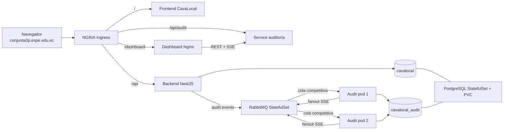

# CavaLocal

Marketplace intermediario de vinos para Caracas: descubre etiquetas, compara precios entre tiendas y **reserva** en la más cercana pagando una **seña online**; la **factura llega por correo**.

> Proyecto en desarrollo. Identidad: burdeos `#641E2E` · dorado `#C2912B` · crema `#F3ECDD`.

## Estructura del repo

| Carpeta | Qué es | Stack |
|---|---|---|
| `web/` | **Frontend oficial** (e-commerce) | HTML/CSS/JS puro (ES modules), sin frameworks |
| `backend/` | **API REST** | NestJS + TypeScript + Prisma + PostgreSQL |
| Raíz (`index.html`, `main.js`, `assets/`) | **Landing** de marketing | HTML + GSAP (scroll-storytelling) |
| `app/` | App móvil previa (**deprecada**) | React Native + Expo |

## Funcionalidades

- **Login** por correo/contraseña y **"Continuar con Google"** (Google Identity Services), en página partida inmersiva.
- **Catálogo** de vinos con búsqueda, filtros, comparación de precios por tienda y vista de mapa.
- **Reserva + seña**: checkout de 4 pasos (reserva → datos → pago → confirmación). Seña **20%** online, saldo **80%** al retirar. **5%** de descuento en la primera reserva.
- **Pago simulado** (validación Luhn/vencimiento/CVV; no se cobra dinero real ni se guardan datos de tarjeta).
- **Factura por correo real** (Nodemailer + Gmail SMTP) + factura imprimible.

## Cómo correrlo en local

### 1. Base de datos (PostgreSQL)
Necesitas un PostgreSQL accesible (local o en la nube, p. ej. Neon/Supabase). Crea una base `cavalocal`.

### 2. Backend (NestJS)
```bash
cd backend
cp .env.example .env          # completa las variables (ver abajo)
npm install
npx prisma migrate deploy     # aplica las migraciones
npx prisma generate
npm run prisma:seed           # datos de ejemplo (incluye ana@example.com / 1234)
npm run start:dev             # API en http://localhost:3001 (Swagger en /docs)
```

Variables de entorno (`backend/.env`):
- `DATABASE_URL` — cadena de conexión a PostgreSQL.
- `JWT_SECRET` — secreto para los tokens.
- `GOOGLE_CLIENT_ID` — OAuth Client ID de Google Cloud (para el login con Google).
- `MAIL_USER` / `MAIL_APP_PASSWORD` — correo Gmail + **contraseña de aplicación** (para enviar la factura).

> Sin `GOOGLE_CLIENT_ID` el login con Google muestra un aviso y el resto funciona. Sin `MAIL_*` la reserva igual se confirma, pero no se envía el correo.

### 3. Frontend (web)
```bash
npx http-server web -p 8080   # http://localhost:8080
```
El front consume el backend en `http://localhost:3001` (configurable en `web/js/config.js`). Pega ahí también tu `GOOGLE_CLIENT_ID`.

## Tests
```bash
cd backend && npm test        # Jest (auth, payments, reservations, notifications)
cd web && npm test            # node --test (validadores, carrusel, tarjeta)
cd audit-service && npm test  # Jest (consulta y paginación de auditorías)
```

## Evaluación conjunta: auditoría distribuida

La solución añade trazabilidad asíncrona con RabbitMQ, almacenamiento independiente y un dashboard SSE. El despliegue se ejecuta en el perfil Minikube **aislado** `conjunta3p`; no inicia ni modifica el perfil predeterminado donde puede existir el proyecto `2P`.

### Arquitectura



Cada mensaje tiene un `eventId` único. La cola se comparte entre las dos réplicas y la base aplica una restricción única, evitando duplicados incluso si RabbitMQ reentrega un mensaje. El ACK se envía solamente después de persistir. Un exchange fanout notifica a todas las réplicas para que cualquier conexión SSE reciba el evento.

### Requisitos

- Una de estas dos configuraciones:
  - Windows nativo con Docker Desktop, Minikube y `kubectl` disponibles en PowerShell.
  - WSL Ubuntu con Docker, Minikube y `kubectl`.
- Al menos 4 CPU y 6 GB de RAM disponibles para el perfil.
- Puertos y acceso de administrador para modificar el archivo `hosts` de Windows.

Los dos flujos usan exclusivamente el perfil `conjunta3p`. Ningún script inicia, detiene, consulta o elimina el perfil predeterminado `minikube`.

### Opción A: Windows nativo con Docker Desktop

Inicia Docker Desktop y abre PowerShell en la raíz del repositorio. No necesitas WSL:

```powershell
Set-ExecutionPolicy -Scope Process Bypass
.\scripts\deploy.ps1
```

El script comprueba Docker, crea o reutiliza únicamente `conjunta3p`, habilita Ingress, construye las imágenes localmente y aplica Kubernetes.

Para exponer el dominio sin escribir `:80` ni `:8080`, abre otra ventana de PowerShell **como administrador**, entra al repositorio y ejecuta:

```powershell
Set-ExecutionPolicy -Scope Process Bypass
.\scripts\tunnel.ps1 -ConfigureHosts
```

La opción `-ConfigureHosts` administra solo la entrada de CavaLocal y deja:

```text
127.0.0.1   conjunta3p.espe.edu.ec
```

Mantén esa ventana abierta mientras utilizas la aplicación. HTTP emplea el puerto 80 por defecto, por eso la URL no necesita mostrarlo. Para detener el túnel usa `Ctrl+C`.

Comandos nativos adicionales:

```powershell
.\scripts\build.ps1
.\scripts\status.ps1
.\scripts\destroy.ps1 -Profile conjunta3p
```

La eliminación exige literalmente `-Profile conjunta3p`; no acepta otro nombre.

### Opción B: WSL/Linux

Entra al repositorio montado en `/mnt/c/...` y ejecuta:

```bash
chmod +x scripts/*.sh
./scripts/deploy.sh
```

Después configura en el archivo `hosts` de Windows:

```text
127.0.0.1   conjunta3p.espe.edu.ec
```

En otra terminal WSL inicia el túnel y déjala abierta:

```bash
./scripts/tunnel.sh
```

El túnel puede solicitar la contraseña `sudo` para publicar los puertos privilegiados 80 y 443.

También se puede ejecutar el paso evaluado manualmente:

```bash
./scripts/build.sh
kubectl config use-context conjunta3p
cd k8s
kubectl apply -f .
```

No uses `minikube start` sin `-p conjunta3p`: ese comando podría reanudar otro proyecto guardado en el perfil predeterminado.

### Dominio local

Con el túnel activo y `127.0.0.1 conjunta3p.espe.edu.ec` configurado, abre:

- Frontend: `http://conjunta3p.espe.edu.ec/`
- Backend/Swagger: `http://conjunta3p.espe.edu.ec/api/docs`
- API de auditoría: `http://conjunta3p.espe.edu.ec/api/audit`
- Dashboard SSE: `http://conjunta3p.espe.edu.ec/dashboard/`

En Windows también puedes apuntar el dominio directamente a la IP devuelta por `minikube ip -p conjunta3p` cuando el driver permita alcanzarla. El script acepta esa variante:

```powershell
$ip = minikube ip -p conjunta3p
.\scripts\configure-hosts.ps1 -Address $ip
```

Si el túnel ejecutado en WSL no fuera visible desde Windows, existe un puente alternativo no privilegiado:

```bash
./scripts/access-windows.sh
```

Esa alternativa sí usa `http://conjunta3p.espe.edu.ec:8080/` y se detiene con `./scripts/stop-windows-access.sh`. No es necesaria cuando `minikube tunnel -p conjunta3p` ya funciona.

### Verificación

Comprueba todos los recursos:

```bash
./scripts/status.sh
kubectl --context conjunta3p get pods -n cavalocal
```

En PowerShell nativo el equivalente es:

```powershell
.\scripts\status.ps1
kubectl --context conjunta3p get pods -n cavalocal
```

Los pods esperados son PostgreSQL, RabbitMQ, backend, frontend, dashboard y dos réplicas de auditoría. Todos deben mostrar `Running` y `READY`.

Para producir un primer evento desde WSL:

```bash
./scripts/smoke-test.sh
```

También puedes hacerlo manualmente:

```bash
curl -X POST http://conjunta3p.espe.edu.ec/api/auth/register \
  -H 'Content-Type: application/json' \
  -d '{"name":"Prueba Auditoría","email":"auditoria1@example.com","password":"Segura123"}'
curl 'http://conjunta3p.espe.edu.ec/api/audit?entity=user&action=create'
```

El evento debe aparecer en el dashboard en menos de dos segundos. Usa un correo diferente si repites la prueba.

Para comprobar automáticamente que el backend continúa funcionando durante una caída temporal de RabbitMQ:

```bash
./scripts/resilience-test.sh
```

Filtros REST disponibles:

```text
GET /api/audit?page=1&pageSize=20
GET /api/audit?entity=reservation&action=create
GET /api/audit?user=ana@example.com
GET /api/audit?from=2026-07-01T00:00:00Z&to=2026-07-31T23:59:59Z
GET /api/audit/:id
GET /api/audit/stream
```

### Configuración y secretos

`k8s/01-config.yaml` contiene credenciales académicas locales para que la evaluación sea reproducible con un solo `kubectl apply`. No deben reutilizarse en producción.

Variables principales:

| Variable | Componente | Propósito |
|---|---|---|
| `DATABASE_URL` | Backend/auditoría | Base PostgreSQL propia de cada servicio |
| `JWT_SECRET` | Backend | Firma de tokens |
| `RABBITMQ_URL` | Backend/auditoría | DNS y credenciales internas |
| `AUDIT_EXCHANGE` | Ambos | Exchange `audit.events` |
| `AUDIT_QUEUE` | Auditoría | Cola competitiva durable |
| `AUDIT_NOTIFICATION_EXCHANGE` | Auditoría | Fanout para SSE entre réplicas |

Para un entorno real, elimina los valores de `stringData` y crea el Secret antes del despliegue:

```bash
kubectl --context conjunta3p -n cavalocal create secret generic cavalocal-secrets \
  --from-literal=POSTGRES_USER=postgres \
  --from-literal=POSTGRES_PASSWORD='CLAVE_SEGURA' \
  --from-literal=JWT_SECRET='SECRETO_LARGO' \
  --from-literal=BACKEND_DATABASE_URL='postgresql://...' \
  --from-literal=AUDIT_DATABASE_URL='postgresql://...' \
  --from-literal=RABBITMQ_DEFAULT_USER=cavalocal \
  --from-literal=RABBITMQ_DEFAULT_PASS='CLAVE_RABBIT'
```

### Operación y limpieza

WSL/Linux:

```bash
./scripts/status.sh
kubectl --context conjunta3p logs -n cavalocal deployment/audit-service
kubectl --context conjunta3p scale deployment/audit-service -n cavalocal --replicas=2
```

La destrucción exige escribir el perfil exacto y jamás usa el perfil predeterminado:

```bash
./scripts/destroy.sh conjunta3p
```

Windows nativo:

```powershell
.\scripts\status.ps1
kubectl --context conjunta3p logs -n cavalocal deployment/audit-service
.\scripts\destroy.ps1 -Profile conjunta3p
```

### Solución de problemas

- PowerShell bloquea scripts: ejecuta `Set-ExecutionPolicy -Scope Process Bypass`; solo afecta la ventana actual.
- Docker no responde: inicia Docker Desktop y espera a que indique que el motor está listo.
- `ImagePullBackOff`: ejecuta nuevamente `./scripts/build.sh` o `.\scripts\build.ps1`; las imágenes son locales al perfil `conjunta3p`.
- Ingress sin dirección: espera uno o dos minutos y revisa `kubectl --context conjunta3p get pods -n ingress-nginx`.
- Dominio sin respuesta: confirma la línea `127.0.0.1 conjunta3p.espe.edu.ec`, limpia la caché DNS de Windows y comprueba que el túnel siga abierto.
- Job de seed fallido tras conservar un PVC antiguo: elimina únicamente el perfil de Conjunta con `./scripts/destroy.sh conjunta3p` y vuelve a desplegar.
- RabbitMQ temporalmente caído: el backend continúa atendiendo y conserva hasta 500 eventos en memoria para reintento; el búfer se pierde si el pod reinicia.

## Licencia
Privado / académico. Todos los derechos reservados a sus autores.
